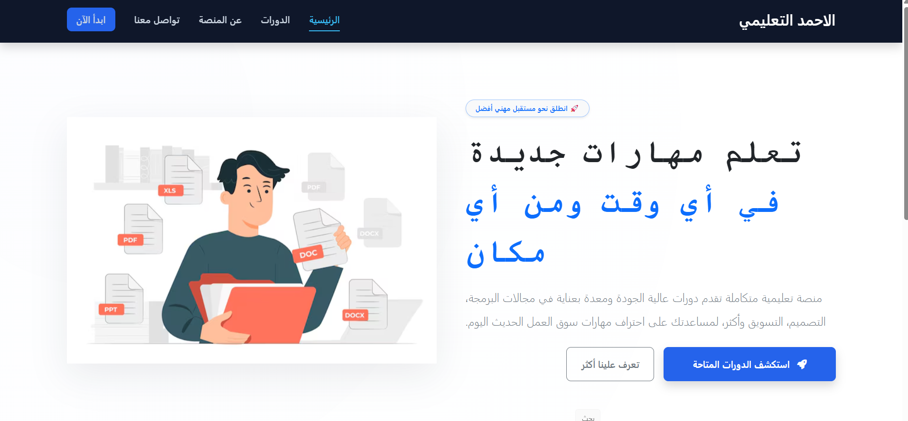

# [اكتب عنوان المشروع هنا]

## 📝 وصف المشروع (Project Description)
منصة تعليمية متكاملة تقدم دورات عالية الجودة ومعدة بعناية في مجالات البرمجة، التصميم، التسويق وأكثر، لمساعدتك على احتراف مهارات سوق العمل الحديث اليوم.

الموقع لمساق العمل الحر في مساقات الكلية 


---

## 👨‍🎓 معلومات الطالب (Student Information)
* **اسم الطالب:** احمد وسام الزعانين  
* **الرقم الجامعي:** 120224819  

---

## 🛠️ التقنيات المستخدمة (Tech Stack)
* **[اسم التقنية الأولى، مثال: HTML/CSS]** - [استخدامها في المشروع]
* **[اسم التقنية الثانية، مثال: JavaScript]** - [استخدامها في المشروع]
* **[اسم التقنية الثالثة، مثال: React أو Python]** - [استخدامها في المشروع]

---

## 📸 صور من المشروع (Screenshots)
يمكنك إضافة صور لواجهات المشروع هنا عن طريق استبدال رابط الصورة:


 

 

## 💻 خطوات التشغيل (Installation & Setup)

تابع الخطوات التالية لتشغيل المشروع على جهازك المحلي:

1. **تحميل أو نسخ المستودع (Clone):**
   ```bash
   git clone [رابط_مستودع_Git_الخاص_بك_هنا]

1. **تشغيل الموقع من ملف index.html**